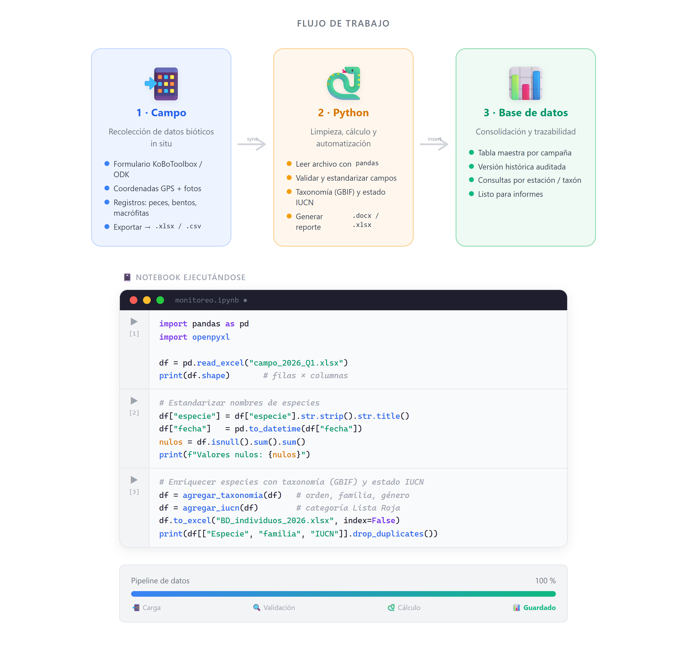

# Monitoreo ictiológico — XLSForm (KoboToolbox) e ingesta de datos

Este repositorio contiene:

| Archivo | Descripción |
|---------|-------------|
| `XLSForm_Kobotools/M_ictico.xlsx` | Formulario **XLSForm** para captura en campo con KoboToolbox / KoboCollect. |
| `ingestar_BD_template.ipynb` / `.py` | Plantilla **estándar y anónima** que procesa el XLS exportado de Kobo y genera las bases de datos de salida. |

> El flujo completo es: **diseñar/cargar el formulario → recolectar en campo → exportar a Excel → ejecutar el script de ingesta**.

---

## Parte 1 — Cómo usar el XLSForm en KoboToolbox

Un **XLSForm** es un formulario definido en un archivo Excel con tres hojas:

- **`survey`** — las preguntas (una por fila): tipo, nombre interno, etiqueta, lógica, cálculos.
- **`choices`** — las opciones de las preguntas de selección (`select_one` / `select_multiple`).
- **`settings`** — el título y el identificador del formulario.

El formulario incluido (`M_ictico.xlsx`) ya está listo para usarse. Estructura general:

- **Datos de la estación**: fecha, identificador y nombre del sitio, complejo hídrico, ubicación GPS y parámetros fisicoquímicos (temperatura, pH, oxígeno, conductividad, transparencia, ancho de cauce).
- **Repetición `mediciones`**: lecturas de flujómetro por punto (flowmeter inicial/final, tiempo, profundidad) con cálculos automáticos de velocidad y caudal.
- **Repetición `Peces`**: registro individuo por individuo (especie, talla, pesos, sexo, estadio gonadal, etc.) con código de registro autogenerado.

### Paso a paso

1. **Crear una cuenta** en KoboToolbox: <https://www.kobotoolbox.org/> (servidor global) o el servidor humanitario, según corresponda. Inicie sesión en <https://kf.kobotoolbox.org/>.

2. **Revisar / editar el formulario (opcional).** Abra `XLSForm_Kobotools/M_ictico.xlsx` en Excel si necesita ajustar preguntas:
   - Añada preguntas agregando filas en la hoja **`survey`** (columnas `type`, `name`, `label`).
   - Añada opciones en la hoja **`choices`** (columnas `list_name`, `name`, `label`); las preguntas `select_one Especie`, `select_one Aparejo`, `select_one Sexo` y `select_one Estadio` se nutren de esas listas.
   - No cambie los nombres internos (`name`) si no es necesario: el script de ingesta los usa para identificar columnas.
   - Valide el archivo antes de subirlo en <https://getodk.org/xlsform/> (resalta errores de sintaxis).

3. **Importar el formulario a Kobo:**
   - En el panel de Kobo: **New** → **Upload an XLSForm** → seleccione `M_ictico.xlsx`.
   - Asigne un nombre al proyecto y confirme.

4. **Desplegar (Deploy).** Abra el proyecto y pulse **Deploy** para habilitarlo en dispositivos.

5. **Recolectar datos en campo:**
   - **App móvil:** instale **KoboCollect** (Android), agregue el servidor de Kobo en *Settings → Server*, descargue el formulario (*Get Blank Form*) y llene los registros sin conexión. Use **+** dentro de los grupos repetidos para agregar varias mediciones o varios peces por estación.
   - **Navegador:** use **Enketo** (*Collect data → Open* o el enlace web del proyecto).
   - Envíe los registros cuando tenga conexión (*Send Finalized Form*).

6. **Exportar los datos a Excel:**
   - En el proyecto: pestaña **Data** → **Downloads**.
   - Tipo de exportación: **XLS** (no XLSX legacy).
   - Marque **incluir grupos repetidos como hojas separadas** (cada `begin_repeat` genera su propia hoja). Recomendado: valores **XML** para los nombres de columnas.
   - Descargue el archivo. Tendrá una hoja para el nivel principal y una hoja por cada repetición (`mediciones`, `Peces`).

7. **Continuar con la ingesta** (Parte 2) usando ese Excel como entrada.

---

## Parte 2 — Ingesta y procesamiento (`ingestar_BD_template`)

El script toma el Excel exportado y produce:

- Una hoja de **individuos por sistema/zona** (con taxonomía GBIF, estado IUCN, dieta y código único), ajustada a una plantilla de destino.
- Una hoja de **Hábitat** en formato largo (parámetros fisicoquímicos y coeficientes de variación de velocidad/profundidad), ordenada según una plantilla.

### Requisitos

```bash
pip install pandas openpyxl requests
```

### Configuración (obligatoria antes de ejecutar)

Abra `ingestar_BD_template.ipynb` (o `.py`) y complete la sección **CONFIGURACIÓN**, marcada con `# >>> COMPLETAR`:

| Variable | Qué poner |
|----------|-----------|
| `PATH_ENTRADA` | Nombre del `.xlsx` exportado de Kobo. |
| `HOJA_PRINCIPAL`, `HOJA_MEDICIONES`, `HOJA_INDIVIDUOS` | Nombres de las hojas dentro de ese Excel. |
| `IUCN_TOKEN` | Token gratuito de la IUCN Red List API v4 (<https://api.iucnredlist.org/>, "Generate a token"). Sin él, la categoría IUCN queda en `NA`. |
| `SISTEMAS_ACUATICOS` | Diccionario `"nombre del sistema": ["codigo-1", "codigo-2", ...]` con los códigos de estación de cada zona. |
| `DIETA` | Diccionario `"Genus species": "categoría trófica"`. |
| `CORRECCIONES_FAMILIA` | (Opcional) forzar familias por género. |
| `EXPORTES_INDIVIDUOS` | Por cada sistema a exportar: su plantilla de encabezados y el archivo de salida. |
| `PLANTILLA_HABITAT`, `SALIDA_HABITAT`, `HOJA_HABITAT` | Plantilla, archivo de salida y hoja para la base de Hábitat. |

> Las constantes `COLS_DROP_*`, `RENOMBRE_*` y `VARIABLES_HABITAT` (sección *CONSTANTES / MAPEOS*) dependen de los nombres de campo del formulario y de los encabezados de sus plantillas; ajústelas solo si cambió el formulario.

### Ejecución
  Se puede realizar en Jupyter Notebook o como script independiente. En ambos casos, asegúrese de que el entorno de Python tenga instaladas las librerías requeridas y que la configuración esté completa.
- **Notebook:** abra `ingestar_BD_template.ipynb`, ejecute las celdas de arriba hacia abajo (la última celda corre el flujo completo).
- **Script:**

  ```bash
  python ingestar_BD_template.py
  ```

### Salidas

- Un archivo por cada entrada de `EXPORTES_INDIVIDUOS` (hoja de individuos por sistema).
- El archivo definido en `SALIDA_HABITAT` (hoja de Hábitat en formato largo).

---

## Notas

- El script consulta las APIs de **GBIF** (taxonomía) e **IUCN** (estado de conservación); requiere conexión a internet. Incluye pausas cortas entre consultas para no saturar los servicios.
- Esta plantilla es anónima: no incluye datos reales de ningún proyecto. Mantenga los archivos con datos confidenciales fuera del control de versiones (ver `.gitignore`).
